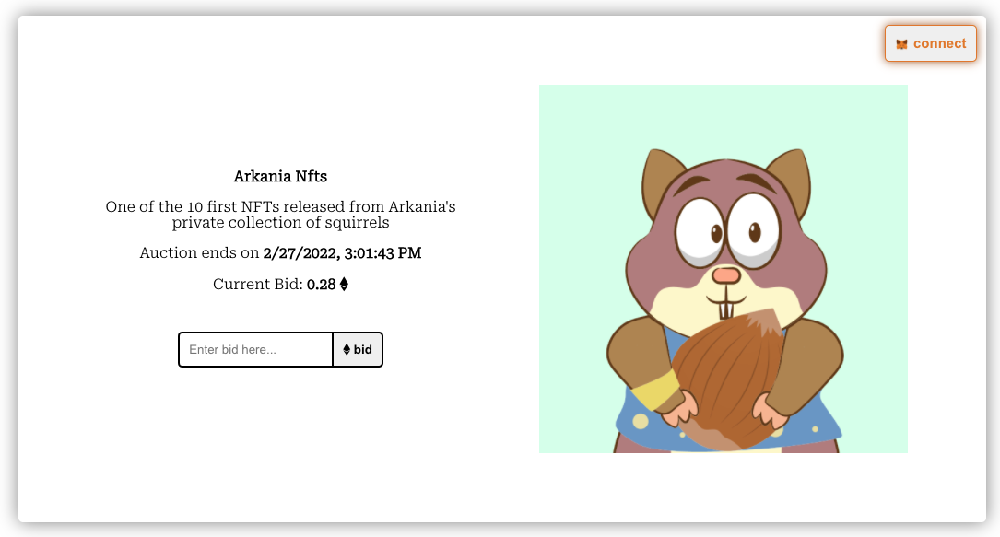

## NFT Auction Dapp

This project implements an ERC721 contract in conjunction with an auction contract to auction NFTs. In order to auction NFTs from an ERC721 contract the owner of the ERC721 contract must approve the auction contract to list those NFTs for sale.

This dapp:

- Deploys an ERC721 contract
- Deploys an auction contract
- Implements a UI to interact with the auction contract
- Allows bidding on approved NFTs
- Integrates with MetaMask

> This project was built using Solidity, Hardhat, ethers.js, React, and the Rinkeby Testnet.

## Link

https://nft-auction-secullod.vercel.app/

## Screenshots

